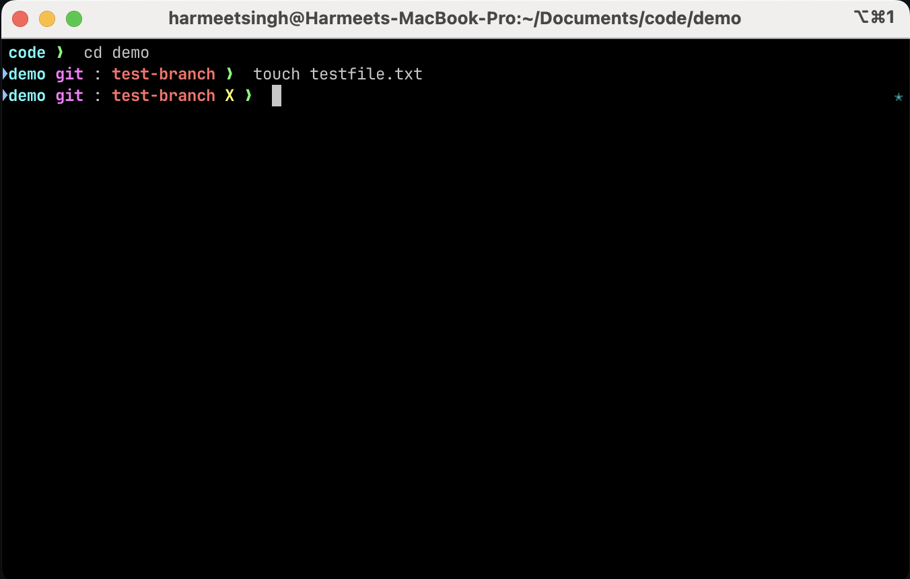

# Sorin Modified Dark
A fork of the ohmyzsh official [sorin](https://github.com/ohmyzsh/ohmyzsh/wiki/Themes#sorin) theme for zsh for dark mode. The original theme did not highlight the dirty state of a git folder. Added a small change for the same and changed the colors a bit.

### Installation/Setup

#### Option1
- Download the theme from [here](https://raw.githubusercontent.com/hrmeetsingh/sorin-modified-dark/main/sorin-modified-dark.zsh-theme)
- Create a file sorin-modified-dark.zsh-theme in ~/.oh-my-zsh/themes/
- Configure the theme in your ~/.zshrc file:ZSH_THEME="sorin-modified-dark"
- Star the repo if you liked it

#### Option2
- Clone the repo
- Install using `make install`
- Configure the theme in your ~/.zshrc file:ZSH_THEME="sorin-modified-dark"
- Uninstall by removing the ~/.zshrc variable and run `make uninstall`
- Star the repo if you liked it

### Preview

